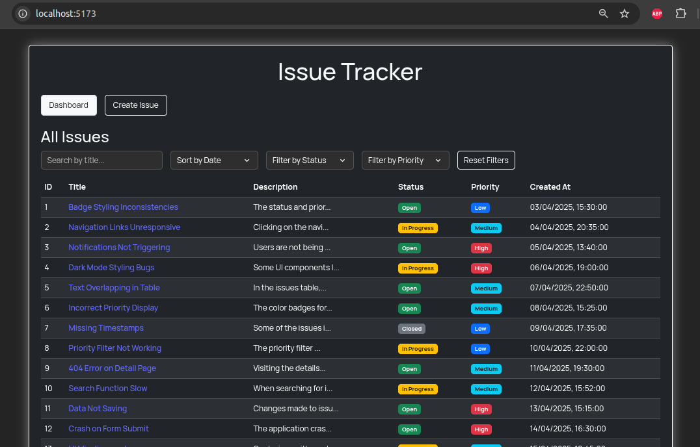
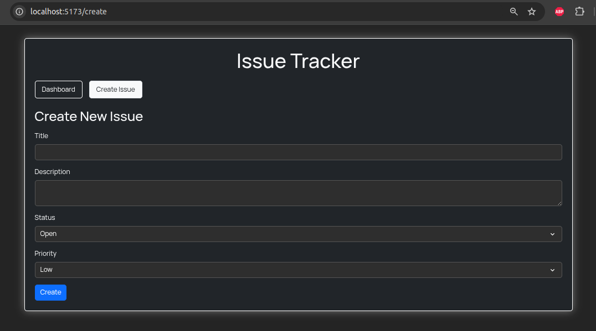
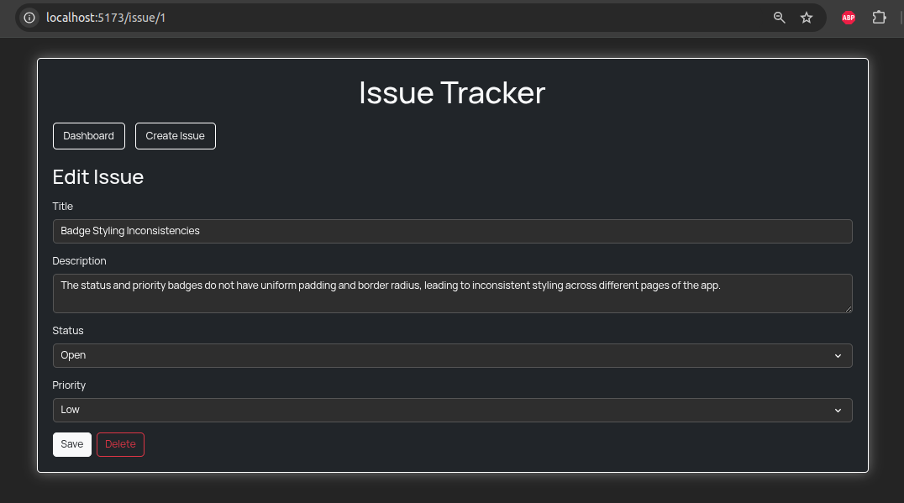

# Issue Tracker Web Application

## 📌 Project Description

A full-stack Issue Tracker Application built with **React.js** for the frontend and **Node.js + Express** for the backend. Users can create, view, update, and delete software issues. The app includes a dashboard view, detailed issue pages, and filtering/sorting functionality to manage issues effectively.

## 🛠️ Installation Instructions

### Frontend (React)

1. Clone this repository to your local machine:
   ```bash
   git clone [https://github.com/lopus-maximus/Issue-Tracker-App.git](https://github.com/lopus-maximus/Issue-Tracker-App.git)
   cd Issue-Tracker-App
   ```

2. Navigate to the `issue-tracker-frontend` folder:

   ```bash
   cd issue-tracker-frontend
   ```

3. Install dependencies:
   ```bash
   npm install
   ```

### Backend (Node.js/Express)

1. In a separate terminal, navigate to the `issue-tracker-backend` folder:

   ```bash
   cd issue-tracker-backend
   ```

2. Install dependencies:
   ```bash
   npm install
   ```

## ▶️ Setup and Running Instructions

### Database Setup

The application uses the provided `data.json` file as the database, which already contains initial issue data. No additional database setup is required.

### Start the Backend Server

1. In the `issue-tracker-backend` folder, run:
   ```bash
   npm start
   ```
   The backend will run on http://localhost:5000

### Start the Frontend App

1. In the `issue-tracker-frontend` folder, run:

   ```bash
   npm run dev
   ```

   The frontend will run on http://localhost:5173

2. On your Browser, type the url - http://localhost:5173

## 🖼️ Screenshots of Working Application

1. Dashboard
   
2. Create Issue
   
3. Edit Issue
   

## 🔑 Features

- **Dashboard**: View all issues at a glance with sorting and filtering options
- **Issue Creation**: Add new issues with title, description, priority, and status
- **Issue Details**: View and edit detailed information for each issue
- **Status Updates**: Change issue status (Open, In Progress, Resolved)
- **Priority Levels**: Assign priority (Low, Medium, High, Critical)
- **Responsive Design**: Works on both desktop and mobile devices

## 🧰 Tech Stack

- **Frontend**: React.js, CSS
- **Backend**: Node.js, Express
- **Data Storage**: JSON file (data.json)
- **Build Tools**: Vite

## 📋 API Endpoints

- `GET /api/issues` - Get all issues
- `POST /api/issues` - Create a new issue
- `GET /api/issues/:id` - Get a specific issue
- `PUT /api/issues/:id` - Update an issue
- `DELETE /api/issues/:id` - Delete an issue
